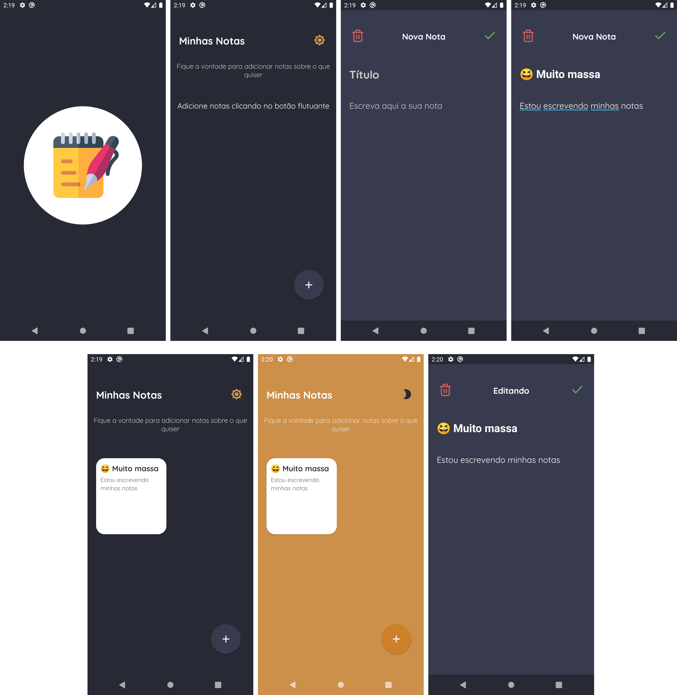

<div align="center">
  <h1>
    
    Minhas Notas
  </h1>

  📱 Uma aplicação para criar notas para lembrá-lo de algo, anotar a lista de compras, escrever seus pensamentos e muito mais. Disponível com Tema Claro e Escuro.


  <a href="https://drive.google.com/file/d/1CTa3Z7fFr7csvD2-DGoEKdfcxXe2dCBU/view?usp=sharing">
    
  </a>

  <a href="./LICENSE.md">
    
  </a>

  <a href="https://app.rocketseat.com.br/me/azanniel">
    
  </a>

</div>
<hr>
<br/>

## 🖼️ Algumas Telas

A Aplicação utiliza do Async Storage para armazenar as Notas que você escreve e edita. O Aplicativo **Minhas Notas** tem temas claro e escuro para qualquer preferência e te da a possibilidade de poder escrever o que quiser nas notas que criar.

<div align="center">
  
</div>

<br>

## 🏭 Tecnologias Utilizadas

O Projeto foi construído usando as seguintes tecnologias e ferramentas:
- **[Typescript](https://www.typescriptlang.org/)**
- **[React Native](https://reactnative.dev/)**
- **[Async Storage](https://react-native-async-storage.github.io/async-storage/)**
- **[React Navigation](https://reactnavigation.org/)**
- **[Styled Components](https://styled-components.com/)**
- **[Eslint](https://eslint.org/)**

## 👷 Como codar no projeto ?

Caso você queira utilizar esse código e codar a partir deste projeto e até mesmo contribuir segue alguns pré requisitos.

### 👨‍💻 Pré requisitos

- Ter instalado o NodeJS
- Ter um emulador Android configurado

### 🎳 Colocando pra rodar

Para iniciar a aplicação use os seguintes comandos

```bash
# Entre na pasta do projeto
$ cd mynotes

# Instale as dependências
$ npm install

# Execute o projeto no seu emulador
$ npx react-native run-android
```

## 📖 Licença

Realizado em 2020

Esse projeto está licenciado pela MIT LICENSE. Para mais informações, leia o arquivo [LICENSE](./LICENSE.md).
